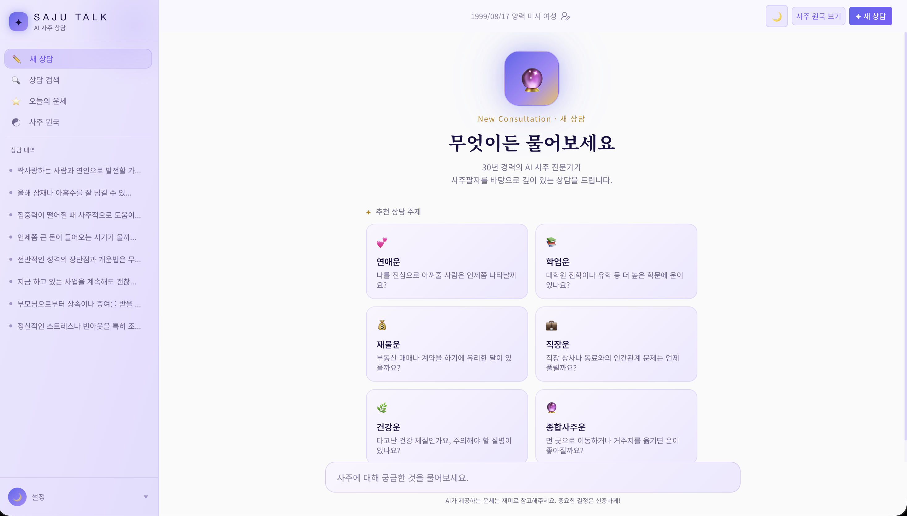

# SAJU TALK

> AI 기반 사주 상담 챗봇 서비스

[웹사이트: https://phrygia-saju-talk-web.vercel.app/](https://phrygia-saju-talk-web.vercel.app/)


사주팔자(四柱八字)와 AI를 결합한 개인 맞춤형 운세 상담 플랫폼입니다.  
사용자의 생년월일·성별·태어난 시간을 기반으로 사주 원국을 계산하고, Google Gemini가 30년 경력의 사주 전문가 페르소나로 실시간 상담을 제공합니다.

---

## 주요 기능

| 기능                 | 설명                                                                                  |
| -------------------- | ------------------------------------------------------------------------------------- |
| **AI 사주 상담**     | Gemini 2.5 Flash 기반 스트리밍 대화형 사주 상담                                       |
| **오늘의 운세**      | 전체·재물·연애·건강·직장·학업·여행 7개 카테고리 점수 및 분석                          |
| **궁합 운세**        | 종합·연애·결혼·성격·재물·소통·갈등지수 7개 카테고리 점수 및 분석                      |
| **만세력 (AI 생성)** | 사주팔자·오행분포·십신분포·성향·대운·세운·월운 분석. 월별 Supabase 캐시로 비용 최적화 |
| **운세 카드 저장**   | 오늘의 운세를 카드 이미지로 다운로드                                                  |
| **상담 내역 관리**   | 대화 목록 자동저장·검색·삭제                                                          |
| **사주 정보 관리**   | 양음력, 태어난 시(時) 포함 생년월일 정보 등록 및 수정                                 |

---

## 기술 스택

### Frontend


### Backend & Database


### AI


### 상태 관리


### 모노레포


---

## 프로젝트 구조

```
saju-talk/
├── apps/
│   └── web/                    # Next.js 메인 앱
│       └── src/
│           ├── app/            # App Router 페이지
│           │   ├── (saju)/     # 채팅 레이아웃 그룹
│           │   │   ├── page.tsx           # 홈 (새 채팅)
│           │   │   ├── chat/[id]/         # 대화 상세
│           │   │   ├── today/[date]        # 오늘의 운세
│           │   │   ├── chat/search/       # 상담 검색
│           │   │   └── saju/              # 만세력 페이지
│           │   ├── api/
│           │   │   ├── chat/              # AI 스트리밍 엔드포인트
│           │   │   ├── fortune/           # 운세 생성 엔드포인트
│           │   │   ├── gunghap/           # 궁합 생성 엔드포인트
│           │   │   └── manseryeok/        # 만세력 생성 엔드포인트
│           │   ├── login/
│               │   └── reset-password/    # 비밀번호 재설정
│           ├── components/     # 공유 컴포넌트
│           ├── store/          # Zustand 스토어
│           ├── lib/            # 유틸리티 (사주 계산, Supabase 클라이언트 등)
│           └── constants/      # 천간·지지·오행 등 상수
│
└── packages/
    └── ui/                     # 공용 UI 컴포넌트 라이브러리 (Storybook)
```

---

## 아키텍처 특징

- **SSR + 쿠키 기반 사이드바 상태**: 서버에서 쿠키를 읽어 초기 렌더링 시 layout shift 없이 사이드바 상태 복원
- **스트리밍 응답**: Vercel AI SDK의 `streamText`로 Gemini 응답을 실시간 스트리밍
- **사주 원국 계산**: 만세력 기반 천간·지지·오행을 클라이언트에서 직접 계산
- **만세력 월별 캐시**: AI가 생성한 만세력 데이터를 Supabase에 월 단위로 저장. 동일 월 재접속 시 DB에서 즉시 반환해 API 비용 절감
- **운세 이미지 저장**: `html-to-image` 라이브러리로 운세 카드를 JPG로 내보내기
- **모노레포**: Turborepo로 앱과 UI 라이브러리를 단일 레포에서 관리
- **불필요한 리렌더링 최적화**: Zustand 셀렉터 + `React.memo`로 레이아웃 전체 리렌더링 방지

---

## AI 코딩 어시스턴트 활용

> `/saju` 만세력 페이지, 전체 서비스 디자인, 일부 Storybook UI 컴포넌트는 **Claude Code(Anthropic)**의 도움을 받아 개발했습니다.

기능 설계 의도와 요구사항은 직접 정의하였으며, 아래 구현 영역에서 AI의 코드 제안을 검토·수정하며 반영했습니다.

| 영역               | 내용                                                                        |
| ------------------ | --------------------------------------------------------------------------- |
| 디자인             | 전체 서비스 다크/라이트 테마, 컬러 시스템, 레이아웃 구조 설계               |
| Storybook 컴포넌트 | Menu, Modal 등 UI 컴포넌트 스타일 개선 및 variant 추가                      |
| 타입 설계          | `ManseryeokData`, `Daeun`, `SeunYear`, `Wolun` 등 전체 도메인 타입 정의     |
| AI 만세력 서비스   | Gemini 프롬프트 작성, 응답 파싱, Supabase 월별 캐시 로직                    |
| UI 컴포넌트        | 사주팔자 테이블, 오행/십신 분포, 대운·세운·월운 테이블, 십신·용어 설명 모달 |
| 스타일             | SCSS Module 기반 다크/라이트 테마 대응                                      |

---

## 시작하기

### 요구 사항

- Node.js 18+
- pnpm 9+

### 환경 변수 설정

`apps/web/.env.local` 파일을 생성합니다:

```env
NEXT_PUBLIC_SUPABASE_URL=your_supabase_url
NEXT_PUBLIC_SUPABASE_ANON_KEY=your_supabase_anon_key
GOOGLE_GENERATIVE_AI_API_KEY=your_gemini_api_key
```

### 개발 서버 실행

```bash
# 의존성 설치
pnpm install

# 개발 서버 실행
pnpm dev

# Storybook 실행 (UI 컴포넌트)
pnpm --filter @repo/ui storybook
```

### 빌드

```bash
pnpm build
```

---

## 배포

### Vercel (메인 앱)

| 설정             | 값           |
| ---------------- | ------------ |
| Root Directory   | `apps/web`   |
| Build Command    | `next build` |
| Output Directory | `.next`      |

### Vercel (Storybook)

| 설정             | 값                                       |
| ---------------- | ---------------------------------------- |
| Root Directory   | `.` (루트)                               |
| Build Command    | `pnpm --filter @repo/ui build-storybook` |
| Output Directory | `packages/ui/storybook-static`           |

---

## 라이선스

MIT
